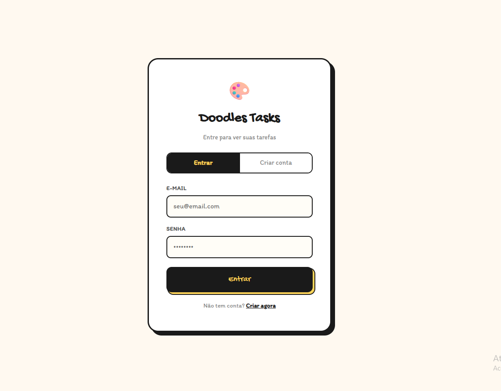
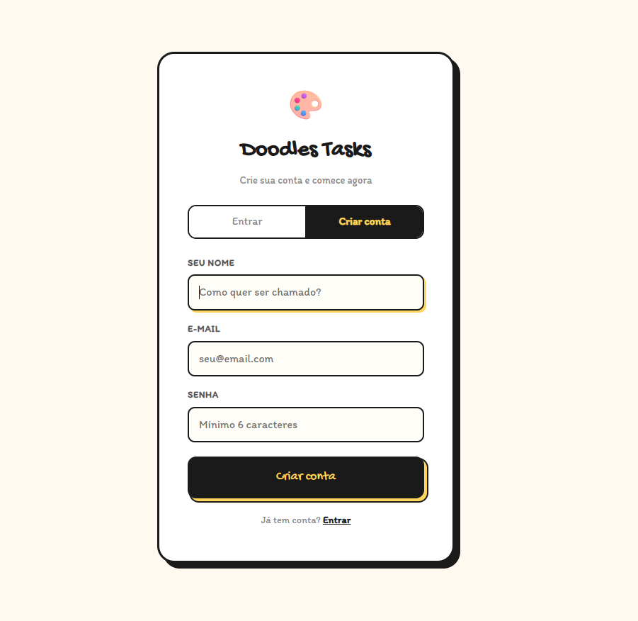
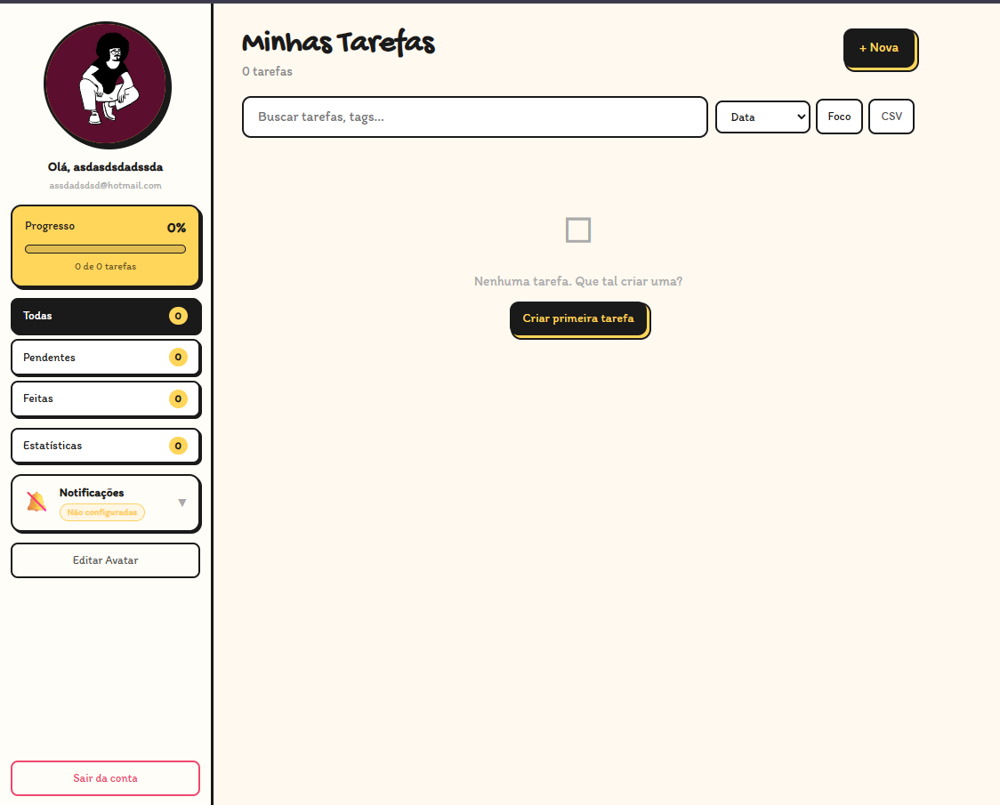
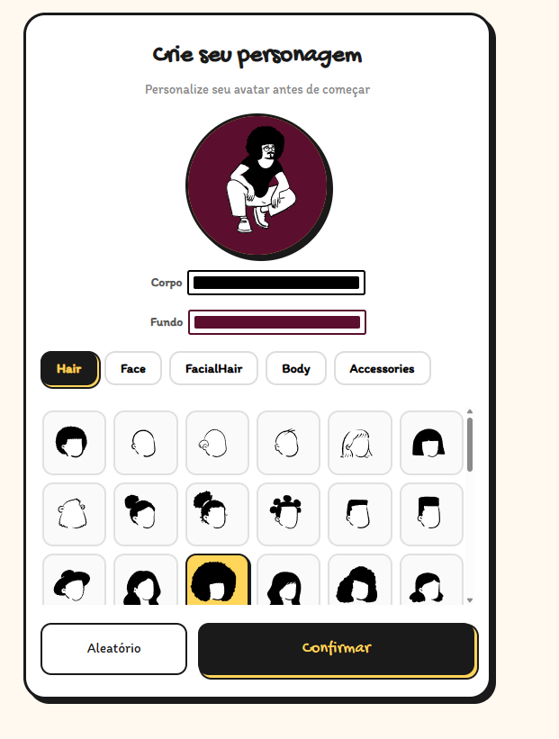
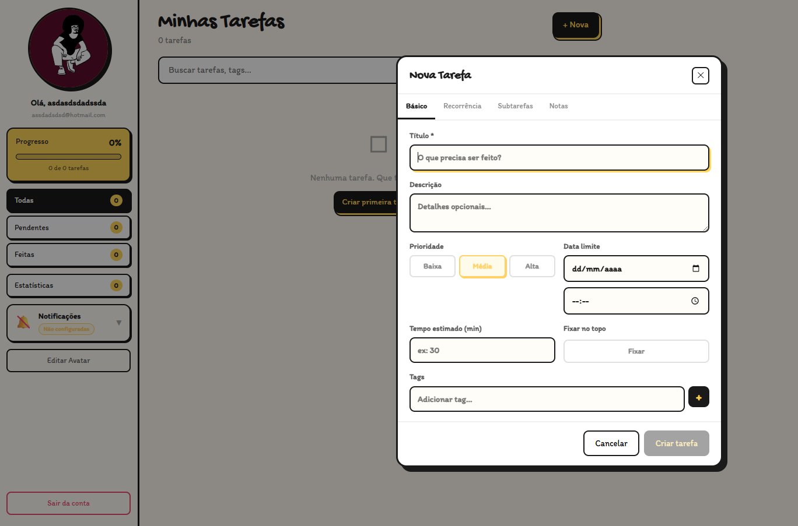

<div align="center" flex-direction: collum>
  <h1>🎨 Doodles Tasks</h1> 
  
</div>

<div align="center">
**Build and customize illustrated characters for your tasks!**

[](LICENSE)
[](https://www.typescriptlang.org/)
[](https://react.dev/)
[](https://vitejs.dev/)
[](https://mongoosejs.com/)

[Reportar Bug](https://github.com/Healer101015/Doodles-Tasks/issues) · [Solicitar Feature](https://github.com/Healer101015/Doodles-Tasks/issues)
<!-- [Demo](#) · quando fazer o viceo, add o demo e referenciar -->

</div>

---

## 📖 Sobre o Projeto

**Doodles Tasks** transforma o gerenciamento de tarefas em algo mais divertido e expressivo. Crie personagens ilustrados únicos e associe-os às suas tarefas, dando personalidade à sua produtividade.

Construído com `react-peeps` para geração de personagens, React + TypeScript no frontend e uma API RESTful em Express + MongoDB com autenticação JWT.

---

## ✨ Funcionalidades

- 🧑‍🎨 **Editor de personagens** — customize poses, rostos, roupas, cores e acessórios
- ✅ **Gerenciamento de tarefas** — crie e organize tarefas com um doodle único para cada uma
- 🔐 **Autenticação** — registro e login com JWT + bcryptjs
- 💾 **Persistência** — suas criações salvas no MongoDB
- 📤 **Exportar** — baixe seus doodles como imagem

---

## 🛠️ Stack

```
Frontend          Backend           Database
─────────         ────────          ─────────
React 18          Express 5         MongoDB
TypeScript 5      Node.js           Mongoose
Vite 5            JWT Auth
Mantine UI        bcryptjs
react-peeps
```

---
## 🖥️ Demonstrativo das telas

### Tela Login
  

### Tela Cadastro
  

### Tela Principal
  

### Tela de Customização
  

### Tela de cadastro de tarefa
  

---

## 🚀 Como Rodar

### Pré-requisitos

- [Node.js](https://nodejs.org/) `>= 20`
- [pnpm](https://pnpm.io/) `>= 9`
- Instância do MongoDB (local ou [MongoDB Atlas](https://www.mongodb.com/atlas))

### 1. Clone e instale

```bash
git clone https://github.com/Healer101015/Doodles-Tasks.git
cd Doodles-Tasks
pnpm install
```


### 2. Rode a aplicação

```bash
# Frontend em modo desenvolvimento
pnpm dev

# Servidor backend (Express)
pnpm start

# Build para produção
pnpm build
```

O frontend estará disponível em `http://localhost:5173` e a API em `http://localhost:3000`.

---

## 📁 Estrutura do Projeto

```
Doodles-Tasks/
├── server.js                    # Inicializa o servidor Express
└── src/
    ├── config/
    │   └── database.js          # Conexão com o MongoDB
    ├── models/
    │   ├── User.js              # Schema do usuário (Mongoose)
    │   └── Task.js              # Schema das tarefas (Mongoose)
    ├── middleware/
    │   └── auth.js              # Middleware de autenticação JWT
    ├── routes/
    │   ├── auth.routes.js       # /api/auth/*
    │   └── task.routes.js       # /api/tasks/*
    └── controllers/
        ├── auth.controller.js   # Lógica de registro e login
        └── task.controller.js   # Lógica de CRUD das tarefas
```

---

## 🔌 API Endpoints

### Autenticação

| Method | Endpoint             | Descrição                       | Auth |
| ------ | -------------------- | ------------------------------- | ---- |
| `POST` | `/api/auth/register` | Registra um novo usuário        | ❌   |
| `POST` | `/api/auth/login`    | Faz login e retorna o token JWT | ❌   |

### Tarefas

| Method   | Endpoint         | Descrição                         | Auth |
| -------- | ---------------- | --------------------------------- | ---- |
| `GET`    | `/api/tasks`     | Lista todas as tarefas do usuário | ✅   |
| `POST`   | `/api/tasks`     | Cria uma nova tarefa              | ✅   |
| `PUT`    | `/api/tasks/:id` | Atualiza uma tarefa existente     | ✅   |
| `DELETE` | `/api/tasks/:id` | Remove uma tarefa                 | ✅   |

> Rotas marcadas com ✅ exigem o header `Authorization: Bearer <token>`

---

## Contribuentes
<table>
  <tbody>
    <tr>
      <td align="center" valign="top" width="14.28%"><a href="https://github.com/Healer101015"><br /><sub><b>João Henrique Brito</b></sub>
          </a><br />
          <a href="#" title="Examples">💡</a> 
          <a href="#" title="Infrastructure (Hosting, Build-Tools, etc)">🚇</a> 
          <a href="#" title="Tests">⚠️</a> 
          <a href="#" title="Reviewed Pull Requests">👀</a><br />  
          <a href="#" title="Bug reports">🐛</a> 
          <a href="#" title="Examples">💡</a> 
          <a href="#" title="Ideas, Planning, & Feedback">🤔</a> 
      </td>   
      <td align="center" valign="top" width="14.28%"><a href="https://github.com/DougSan7/"><br /><sub><b>Douglas Santos</b></sub>
          </a><br />
          <a href="#" title="Code">💻</a>
          <a href="#" title="Documentation">📖</a>
          <a href="#" title="Reviewed Pull Requests">👀</a> 
          <a href="#" title="Ideas, Planning, & Feedback">🤔</a> 
          <a href="#" title="Talks">📢</a>
      </td>
        <td align="center" valign="top" width="14.28%"><a href="https://github.com/maariana-gen"><br /><sub><b>Mariana de Oliveira Soares</b></sub>
      </a><br />
          <a href="#" title="Code">💻</a>
          <a href="#" title="Reviewed Pull Requests">👀</a> 
          <a href="#" title="Ideas, Planning, & Feedback">🤔</a> 
          <a href="#" title="Talks">📢</a>
      </td>
        
  </tbody>
</table>

---

## 📄 Licença

Distribuído sob a licença MIT. Veja [LICENSE](LICENSE) para mais informações.
